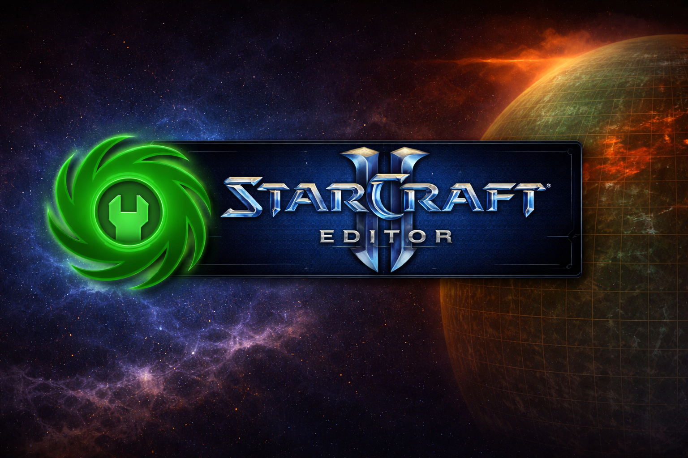

# StarCraft II Arcade Publishing Restoration — Open Letter

This repository contains a public open letter and support tracking regarding the removal of StarCraft II Arcade publishing access.

Developers and players are requesting restoration or preservation of publishing functionality for legacy and active projects.

---

## Current Support

- Developer Signatories: <!--DEV_COUNT-->2<!--/DEV_COUNT-->
- Cumulative Arcade Plays Represented: <!--PLAY_COUNT-->52352<!--/PLAY_COUNT-->
- Player Supporters: <!--PLAYER_COUNT-->533<!--/PLAYER_COUNT-->

---

## Links

📄 Full Open [Letter](https://medium.com/@thedrusus/an-open-letter-to-blizzard-entertainment-e84513bfc45f)

🧑‍💻 Developer Signatory [Form](https://docs.google.com/forms/d/1w0WrumGEnnyGeQzmCVXhLEzbJRSNLS9ZmlxFd8fbvak)

🎮 Player Support [Form](https://docs.google.com/forms/d/1NqSVUg4RBZPc88Bgt1oHZMixDbWb33WWrZtEXDYcZ6M)
